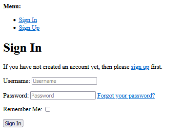

# Djamgo Conceitos em Auth

Sistema ``web`` para cadastro de usuários, com Framework [Django](https://docs.djangoproject.com/en/5.0/) e integração com Banco de dados.&nbsp; 
Desta vez traremos uma visão geral sobre autenticações de forma **``segura``** e **``profissional``** para o desenvolvimento de aplicativos utilizando a biblioteca [Allauth](https://docs.allauth.org/en/latest/installation/quickstart.html).

---

## Versão v1.0
Na versão v1.5, trabalhamos com o frontend da aplicação 

&nbsp;

> ### Pré-requisitos

Python 3.9+
 
&nbsp;
  
> ### Bibliotécas
 
[Django](https://docs.djangoproject.com/en/5.0/)

[Allauth](https://docs.allauth.org/en/latest/installation/quickstart.html)

[SQLite](https://www.sqlite.org/docs.html)

&nbsp;

> ### Funcionalidades:

* Cadastrar novos usuários com ``nome`` e ``senha``.
* Salvar os dados em um banco de dados [SQLite](https://www.sqlite.org/docs.html)

&nbsp; 

> ### Pré-code
> > virtual environment
#### Feito via terminal. Instalação de um ambiente virtual
    python -m venv env
    .\env\Scripts\activate
&nbsp;
> > #### Instalando as bibliotécas

    python -m pip install --upgrade pip
    pip install django
    pip install django-allauth

&nbsp;
> ### Code
> > #### Criação do projeto django_auth
 
    django-admin startproject django_allaut .

---
&nbsp;
1. Em ``django_auth/settings.py`` iremos configurar nosso projeto.&nbsp;
   
&nbsp;

* Após a constante ``DATABASES`` inserimos a constante ``AUTHENTICATION_BACKENDS``

**Primeira** linha permite a autenticação normal de usuarios

**Segunda** linha permite a autenticação personalizada do ``allauth`` (por exemplo com e-mail)

&nbsp;

    AUTHENTICATION_BACKENDS = [
        'django.contrib.auth.backends.ModelBackend',
        'allauth.account.auth_backends.AuthenticationBackend',
    ]

&nbsp;

* Em *``INSTALLED_APPS``* Vamos inserir o **allauth** 
   
        'django.contrib.sites'
        'allauth',
        'allauth.account'

&nbsp;
 
* Defina o *``SITE_ID``* logo após *``INSTALLED_APPS``*

        SITE_ID = 1

&nbsp;
 
* Em *``MIDDLEWARE``* adicione

        'allauth.account.middleware.AccountMiddleware',

---
&nbsp;
 
2. Em ``URLS.py``&nbsp;
* No arquivo **urls.py** vamos criar a **rota** para o **allauth**

        path('accounts/', include('allauth.urls')),

---
&nbsp;
 
3. Etapa de banco de dados

        python manage.py makemigrations
        python manage.py migrate

&nbsp;
 
* Criaremos um ``super usuário`` para visulizar o projeto

        python manage.py createsuperuser

&nbsp;
 
* Vamos rodar o ``servidor``
  
        python manage.py runserver

&nbsp;
 
* Em uma janela ``anônima`` de navegador vamos inserir o ``link``
    
        http://127.0.0.1:8000/accounts/login/
---
&nbsp;
&nbsp;

Se tudo deu **certo**, você deverá estar vendo esta tela 

&nbsp;
 

--- 
&nbsp;
 
4. Para trabalhar o ``HTML`` das paginas ``accounts``, vamos criar suas copias na pasta de templates do nosso projeto. 
&nbsp; 
``*NUNCA ALTERE OS ARQUIVOS DENTRO DA BIBLIOTECA*``.

&nbsp;
 
* Vamos em ``settings.py`` e em *``TEMPLATES``* e iremos alterar a costante *``DIRS``* 
&nbsp;
Não esqueça de importar a biblioteca *OS*

        import os

        'DIRS' = [os.path.join(BASE_DIR, 'templates')]

&nbsp;
 
* Crie na *``raiz``* do projeto uma pasta chamada *``templates``*. 
&nbsp;
Para dentro dessa pasta copie de 
&nbsp; 
*env/lib/allauth/templates/* ``account`` e ``openid``

&nbsp;
 
* Agora você pode alterar os arquivos *``HTML``* a seu gosto

&nbsp;

> ### Implementação

 [Django](https://docs.djangoproject.com/en/5.0/) em uso para codificação, junto a bibliotéca [Allauth](https://docs.allauth.org/en/latest/installation/quickstart.html)

&nbsp;

> Créditos

Código inicial baseado no canal [Paythonando](https://www.youtube.com/playlist?list=PLCxYb_kl1FLaVvULMOXthDa9DP5-anT7A).

Documentação e melhorias adicionadas por [Wesley Pereira](https://github.com/wesleyp846)

&nbsp;
> Licença
> > MIT

Espero que a documentação os ajude a entender a aplicação! 
Por favor, sinta-se a vontade para melhorá-la. &nbsp;

Para mais [LinkedIn](https://www.linkedin.com/in/wesleyp846)